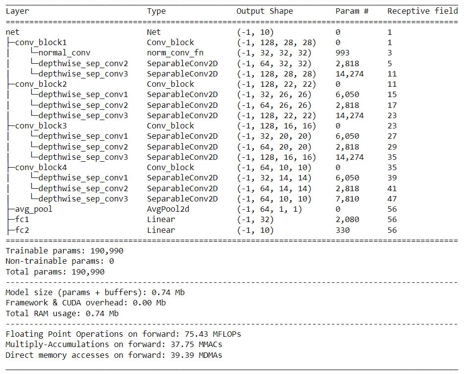
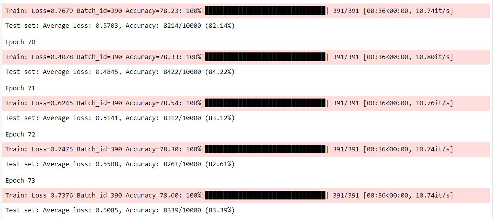

# Assignment 9

# Problem Statement

To train CNN for CIFAR10 dataset

1. has the architecture to C1C2C3C40 (No MaxPooling, but 3 3x3 layers with stride of 2 instead) (If you can figure out how to use Dilated kernels here instead of MP or strided convolution, then 200pts extra!)
2. total RF must be more than 44
3. one of the layers must use Depthwise Separable Convolution
4. one of the layers must use Dilated Convolution
5. use GAP (compulsory):- add FC after GAP to target #of classes (optional)
6. use argumentation library and apply:horizontal flip,shiftScaleRotate, coarseDropout 
7. achieve 85% accuracy, as many epochs as you want. Total Params to be less than 200k.

# File Structure

repo contains all the code required during training in different modules
   - model.py -> Contains the architecture
   - uitls.py -> contains supportive functions for code
   - main.ipynb -> contains the execution of code 

# Model Parameters

The Model Uses [***Dilated Convolution and Depthwise Separable Convolution***] 

    

 
# Training Logs

    

       

# Results

  Test Accuracy : 84%
  Train Accuracy : 78%

